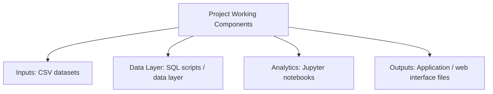

# Healthcare Insurance Claims Analytics

### A portfolio-ready repository for Healthcare Insurance Claims Analytics, documented from the files and technologies present in the project.

   

---

## Project Overview

A portfolio-ready repository for Healthcare Insurance Claims Analytics, documented from the files and technologies present in the project.

## Problem / Objective

**Application:** Healthcare data analysis.

This README is generated from the actual project folder. Technologies, components, inputs, outputs, and architecture claims are included only when supported by repository evidence.

## Project Working Component Map

The repository verifies these working components. A sequence is intentionally not invented where the project documentation does not prove one.

## Verified Working Components

| Layer / Area | Verified Evidence |
|--------------|-------------------|
| Inputs | CSV datasets |
| Data / Storage | SQL scripts / data layer |
| Analytics / Models | Jupyter notebooks |
| Outputs / Interface | Application / web interface files |

## Technology Stack

| Technology | Evidence |
|------------|----------|
| Jupyter Notebook | Verified from project files |
| SQL | Verified from project files |
| CSV | Verified from project files |
| HTML | Verified from project files |

## Core Repository Files

| File | Type |
|------|------|
| `healthcare-claims-analytics\data\healthcare_dataset.csv` | CSV |
| `healthcare-claims-analytics\python\admission_trends.png` | PNG |
| `healthcare-claims-analytics\python\billing_distribution.png` | PNG |
| `healthcare-claims-analytics\python\condition_analysis.png` | PNG |
| `healthcare-claims-analytics\python\healthcare_eda.ipynb` | IPYNB |
| `healthcare-claims-analytics\python\los_admission_analysis.png` | PNG |
| `healthcare-claims-analytics\sql\healthcare_analysis.sql` | SQL |
| `healthcare-claims-analytics\tableau\dashboard_screenshot.png` | PNG |
| `healthcare-claims-analytics\tableau\healthcare_dashboard.html` | HTML |

## Project Structure

`	ext
p-1140601611/
  - docs/
  - healthcare-claims-analytics/
`

## How the Project Is Organized

The architecture/workflow visual above is the primary working view of this project. When an existing architecture or workflow image is present, that project asset is used directly. Otherwise, the automation derives a Mermaid visual only from verified project documentation and artifacts.

## Methodology & Documentation Policy

- Local project files are the source of truth.
- Existing project README content is preserved under `docs/ORIGINAL_README.md` in the safe publication copy when available.
- Technology badges are created only from detected project evidence.
- Unsupported databases, cloud services, APIs, models, metrics, deployment claims, users, clients, revenue, savings, or business outcomes are omitted.
- When workflow order cannot be proven, the visual is explicitly shown as a working component map rather than a fabricated sequence.

## Explore

Use the repository files together with the architecture/workflow visual, technology table, and project structure above to understand the implementation.

## Contact

- GitHub: https://github.com/gawandeshil03-ops
- LinkedIn: https://www.linkedin.com/in/shilgawande2004
- Email: gawandeshil9@gmail.com

---

[<- Return to Healthcare analytics Portfolio](https://github.com/gawandeshil03-ops/healthcare-analytics-portfolio)